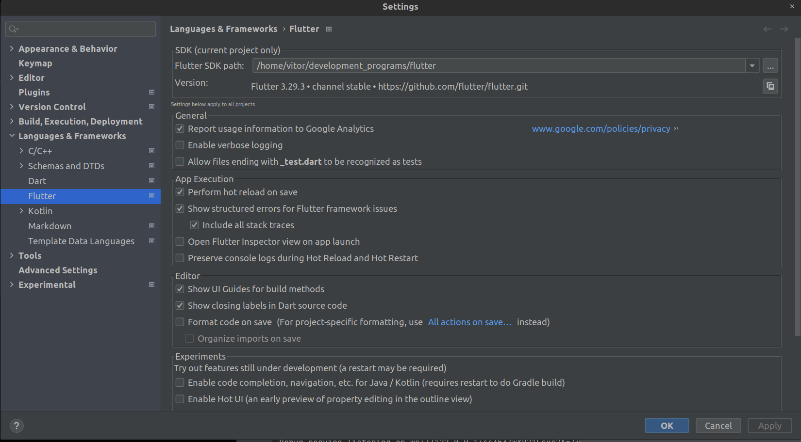
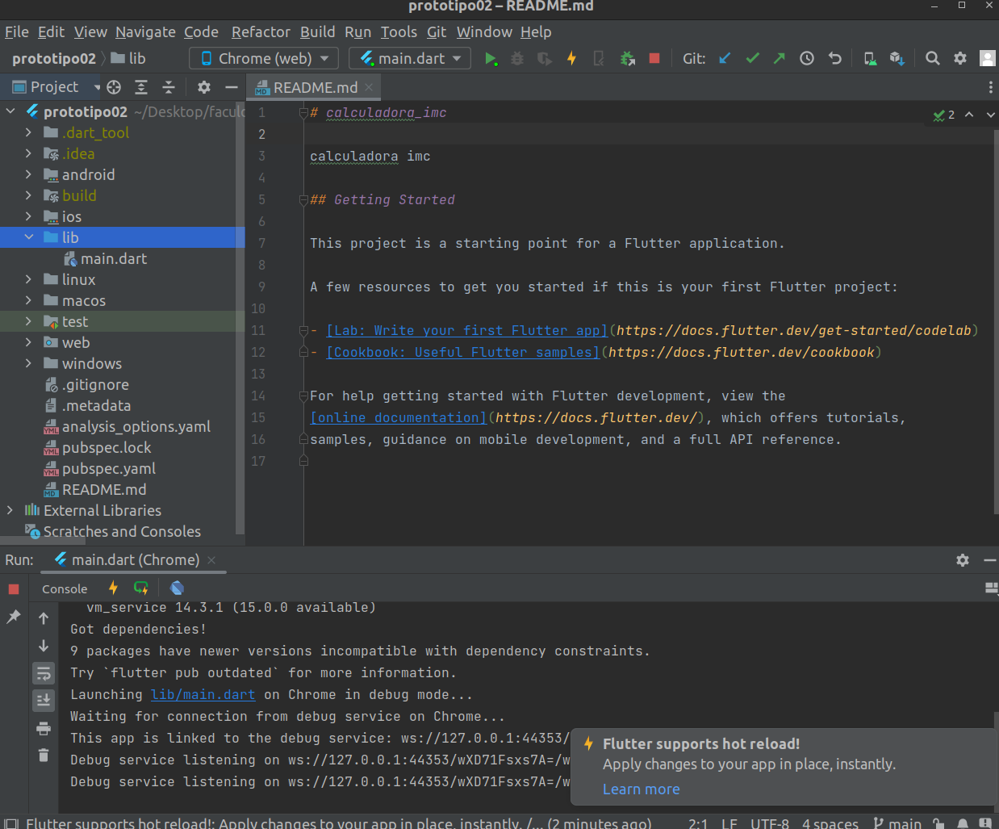

# Dependências 

1. instale fluter sdk 
2. executar o cmd `echo 'export PATH="$HOME/development_programs/flutter/bin:$PATH"' >> ~/.bashrc`
  - use o path correto do seu flutter.
3. executar o cmd `source ~/.bashrc`
4. instale o android studio.
5. no android studio, configure o flutter sdk.

# Execução do projeto

1. Selecione a plataforma onde você quer executar (web)
2. Clique no botão de play

