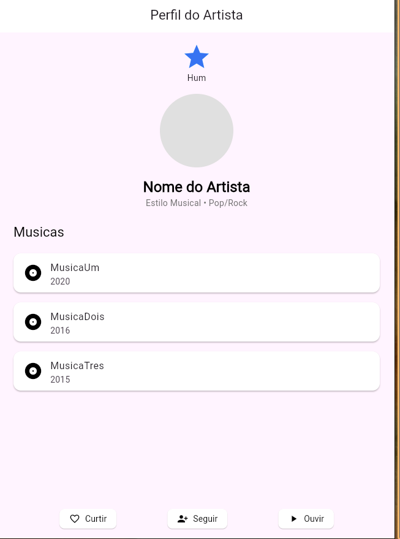

## Equipe

- Alexandre Junior Garcia dos Santos
- Lucas Gabriel Novak
- Vitor Roberto Batista Schirmer

## 1. Protótipo 1

- Text Field
  - descrição: campo de inserção de dados.
  - aplicaçao: usado para inserir o peso e altura do usuário.
  - como usar:
  ```dart
   // Renderiza o texto, definido o label e váriavel de controle.
   TextField(
          controller: _pesoController,
          keyboardType: TextInputType.numberWithOptions(decimal: true),
          decoration: const InputDecoration(
            labelText: 'Peso (kg)', border: OutlineInputBorder(),
          ),
  ),
  ```
- Text:
  - descrição: container contendo algum texto.
  - aplicação: usado para mostrar o resultado do cálculo.
  - como usar:
  ```dart
  Text(
    _resultado,
    style: Theme.of(context).textTheme.headlineMedium,
  ),
  ```
- Sized box
  - descrição: container vazio para criar espaçamento entre componentes
  - aplicação: usado para criar espaço vazio entre os TextField.
  - como usar:
  ```dart
  const SizedBox(height: 16),
  ```
- ElevatedButton
  - descrição: renderiza um botão com uma elevação (box-shadow)
  - aplicação: usado para disparar a função de calcular IMC.
  - como usar:
  ```dart
  ElevatedButton(
    onPressed: _onCalcular,
    child: const Text('CALCULAR IMC'),
  ),
  ```
- Padding:
  - descrição: espaçamento interno de um componente
  - aplicação: usado para adicionar um espaçamento interno no componente ElevatedButton, melhorando seu design.
  - como usar:
  ```dart
  Padding(
    padding: const EdgeInsets.all(16),
    child: ElevatedButton(
      onPressed: _onCalcular,
      child: const Text('CALCULAR IMC'),
    ),
  )
  ```


## 2. Protótipo 2

- AppBar
  - descrição: componente renderizado no topo do aplicativo.
  - aplicaçao: usado para modificar o texto no topo do aplicativo, inserindo o texto "Perfil de artista"
  - como usar:
  ```dart
   // Renderiza o texto, definido o label e váriavel de controle.
   AppBar(
        // Título da barra, exibindo "Perfil do Artista".
        title: const Text('Perfil do Artista'),
        // Centraliza o título na AppBar.
        centerTitle: true,
        // Define a cor de fundo da AppBar como branca, garantindo um visual limpo.
        backgroundColor: Colors.white,
  ),
  ```

- Text Field
  - descrição: campo de inserção de dados.
  - aplicaçao: usado para inserir o peso e altura do usuário.
  - como usar:
  ```dart
   // Renderiza o texto, definido o label e váriavel de controle.
   TextField(
          controller: _pesoController,
          keyboardType: TextInputType.numberWithOptions(decimal: true),
          decoration: const InputDecoration(
            labelText: 'Peso (kg)', border: OutlineInputBorder(),
          ),
  ),
  ```
- Text:
  - descrição: container contendo algum texto.
  - aplicação: usado para mostrar o resultado do cálculo.
  - como usar:
  ```dart
  Text(
    _resultado,
    style: Theme.of(context).textTheme.headlineMedium,
  ),
  ```
- Sized box
  - descrição: container vazio para criar espaçamento entre componentes
  - aplicação: usado para criar espaço vazio entre os TextField.
  - como usar:
  ```dart
  const SizedBox(height: 16),
  ```
- ElevatedButton
  - descrição: renderiza um botão com uma elevação (box-shadow)
  - aplicação: usado para disparar a função de calcular IMC.
  - como usar:
  ```dart
  ElevatedButton(
    onPressed: _onCalcular,
    child: const Text('CALCULAR IMC'),
  ),
  ```
- Padding:
  - descrição: espaçamento interno de um componente
  - aplicação: usado para adicionar um espaçamento interno no componente ElevatedButton, melhorando seu design.
  - como usar:
  ```dart
  Padding(
    padding: const EdgeInsets.all(16),
    child: ElevatedButton(
      onPressed: _onCalcular,
      child: const Text('CALCULAR IMC'),
    ),
  )
  ```
  
**Resultado**:


