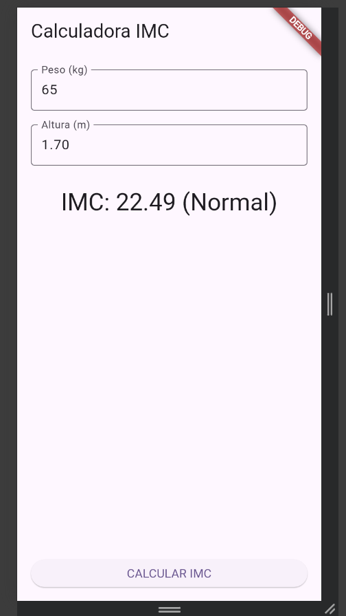

## Equipe

- Alexandre Junior Garcia dos Santos
- Lucas Gabriel Novak
- Vitor Roberto Batista Schirmer

## 1. Protótipo 1

**Descrição**: 
Implementação da tela para calcular o IMC do usuário.

**Aplicações**: 
Criação de 2 inputs: Peso e metros, botão de calcular e o container com o resultado do calculo.

**Como usar**:
O códig completo está disponível em: [prova01/prototipo01/lib/main.dart](prova01/prototipo01/lib/main.dart)

Segue o a explicação do código do protótipo 1.
```dart
// declarações das funções:
Map<String, dynamic> calcImc(double peso, double altura) {
  final double imc = peso / (altura * altura);
  String classificacao;
  if (imc < 16.5) {
    classificacao = 'Muito magro';
  } else if (imc < 18.5) {
    classificacao = 'Magro';
  } else if (imc < 25.0) {
    classificacao = 'Normal';
  } else if (imc < 30.0) {
    classificacao = 'Sobrepeso';
  } else {
    classificacao = 'Obeso';
  }
  return {'valor': imc, 'classificacao': classificacao};
}

void _onCalcular() {
  final double peso = double.tryParse(_pesoController.text.replaceAll(',', '.')) ?? 0;
  final double altura = double.tryParse(_alturaController.text.replaceAll(',', '.')) ?? 0;
  final imcData = calcImc(peso, altura);
  setState(() {
    _resultado = 'IMC: ${imcData['valor'].toStringAsFixed(2)} '
        '(${imcData['classificacao']})';
  });
}

// Agrupa-se em coluna os seguintes componentes:
// 1. TextField: Peso (kg)
// 2. SizedBox: Container vazio para criar espaçamento entre os componentes.
// 3. TextField: Altura (m)
// 4. SizedBox: Container vazio para criar espaçamento entre os componentes.
// 5. Text: texto resultado
Column(
      children: [
        TextField(
          controller: _pesoController,
          keyboardType: TextInputType.numberWithOptions(decimal: true),
          decoration: const InputDecoration(
            labelText: 'Peso (kg)', border: OutlineInputBorder(),
          ),
        ),
        const SizedBox(height: 16),
        TextField(
          controller: _alturaController,
          keyboardType: TextInputType.numberWithOptions(decimal: true),
          decoration: const InputDecoration(
            labelText: 'Altura (m)', border: OutlineInputBorder(),
          ),
        ),
        const SizedBox(height: 24),
        Text(
          _resultado,
          style: Theme.of(context).textTheme.headlineMedium,
        ),
      ],
)  

// Insere um botão na barra de navegação inferior.
// Ao clicar no botão, o evento onPressed é disparado executando a função `onCalcular`
bottomNavigationBar: Padding(
  padding: const EdgeInsets.all(16),
  child: ElevatedButton(
    onPressed: _onCalcular,
    child: const Text('CALCULAR IMC'),
  ),
)
```

**Resultado**:


## 1. Protótipo 2